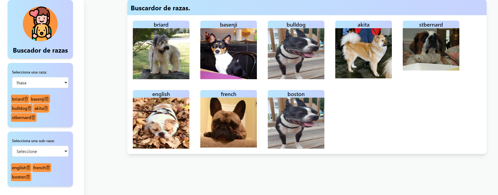
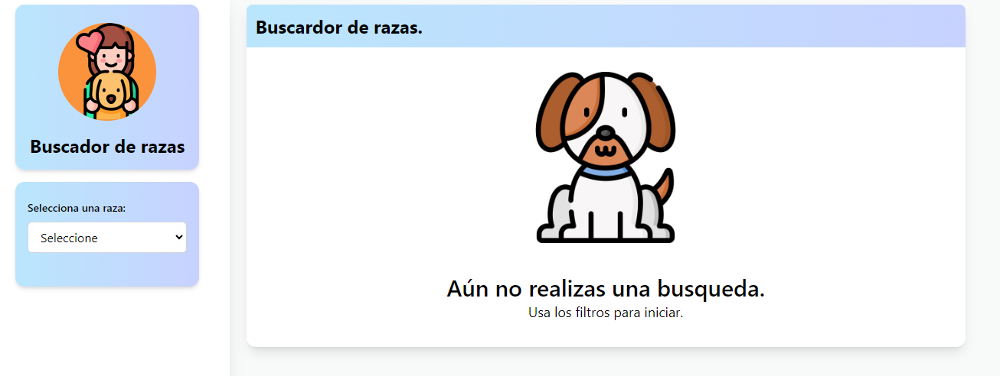

# Dog-CEO Challenge:

En Dog-CEO pordras conocer las distintas razas caninas , e incluso las sub razas. [Explorador de razas ¡AQUI!](https://mayrenejose.github.io/Dog-challenge/).

## Arquitectura:


```
dog-challenge
├─ package-lock.json
├─ package.json
├─ postcss.config.js
├─ public
│  ├─ favicon.ico
│  ├─ index.html
│  ├─ logo192.png
│  ├─ logo512.png
│  ├─ manifest.json
│  └─ robots.txt
├─ README.md
├─ src
│  ├─ components
│  │  ├─ App.tsx
│  │  ├─ filterBox
│  │  │  ├─ filterByRace
│  │  │  │  ├─ index.test.tsx
│  │  │  │  └─ index.tsx
│  │  │  ├─ filterBySubRace
│  │  │  │  └─ index.tsx
│  │  │  ├─ index.tsx
│  │  │  ├─ logo
│  │  │  │  ├─ index.test.tsx
│  │  │  │  └─ index.tsx
│  │  │  ├─ optionsBox
│  │  │  │  ├─ index.test.tsx
│  │  │  │  └─ index.tsx
│  │  │  ├─ selectionLabel
│  │  │  │  ├─ index.test.tsx
│  │  │  │  └─ index.tsx
│  │  │  └─ selector
│  │  │     ├─ index.test.tsx
│  │  │     └─ index.tsx
│  │  └─ listImgs
│  │     ├─ allImgs
│  │     │  ├─ index.test.tsx
│  │     │  └─ index.tsx
│  │     ├─ emptySearch
│  │     │  ├─ index.test.tsx
│  │     │  └─ index.tsx
│  │     ├─ index.tsx
│  │     ├─ listHeader
│  │     │  ├─ index.test.tsx
│  │     │  └─ index.tsx
│  │     └─ showImgs
│  │        ├─ index.test.tsx
│  │        └─ index.tsx
│  ├─ hooks
│  │  ├─ useFetch
│  │  │  └─ index.tsx
│  │  └─ useMobile
│  │     └─ index.tsx
│  ├─ imgs
│  │  ├─ deleteX.png
│  │  ├─ dog.png
│  │  ├─ img-1.png
│  │  ├─ img-2.png
│  │  ├─ mobile-1.jpeg
│  │  ├─ mobile-2.jpeg
│  │  ├─ mobile-3.jpeg
│  │  └─ pets.png
│  ├─ index.tsx
│  ├─ setupTests.ts
│  ├─ styles
│  │  └─ index.css
│  └─ type
│     └─ index.tsx
├─ tailwind.config.js
└─ tsconfig.json

```

## Herramientas utilizadas:

- React JS.
- Typescript.
- Tailwin CSS.
- Jest JS.

## Imagenes:

### Version destock:





### Version mobile:


